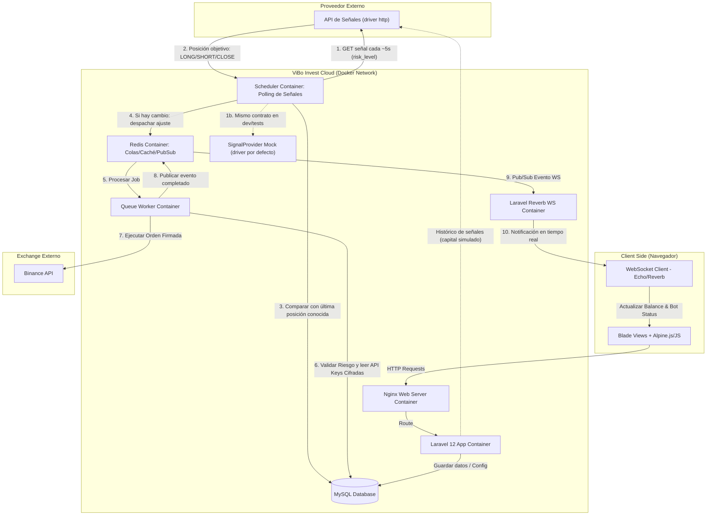
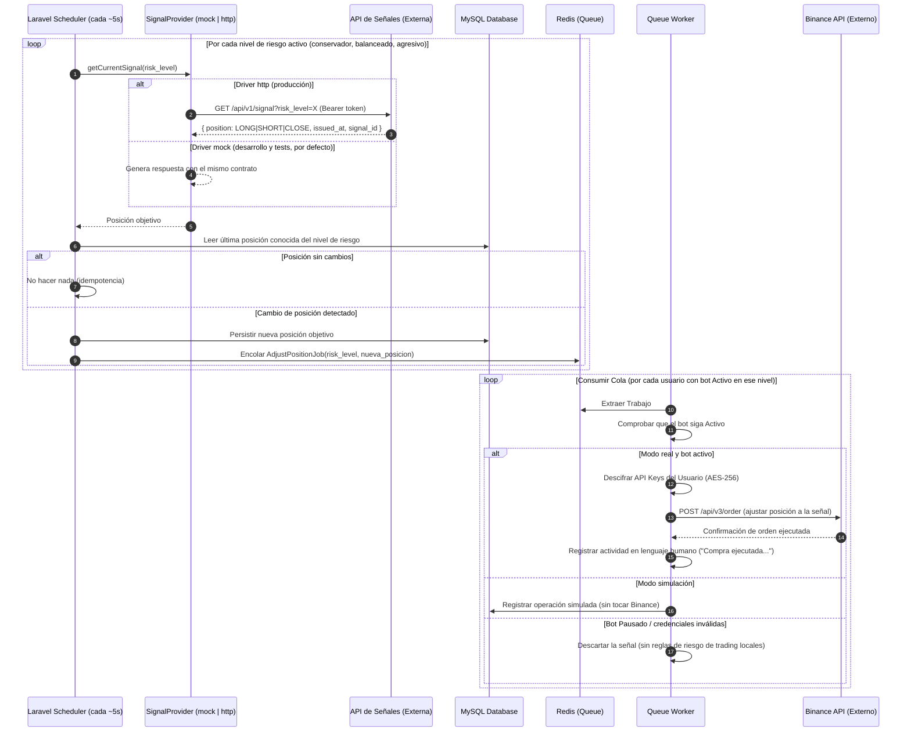
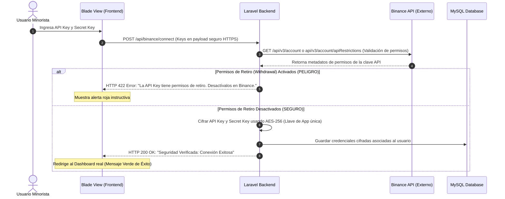
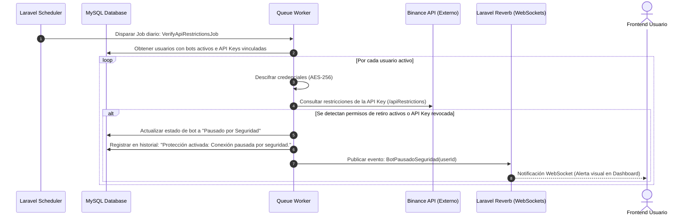
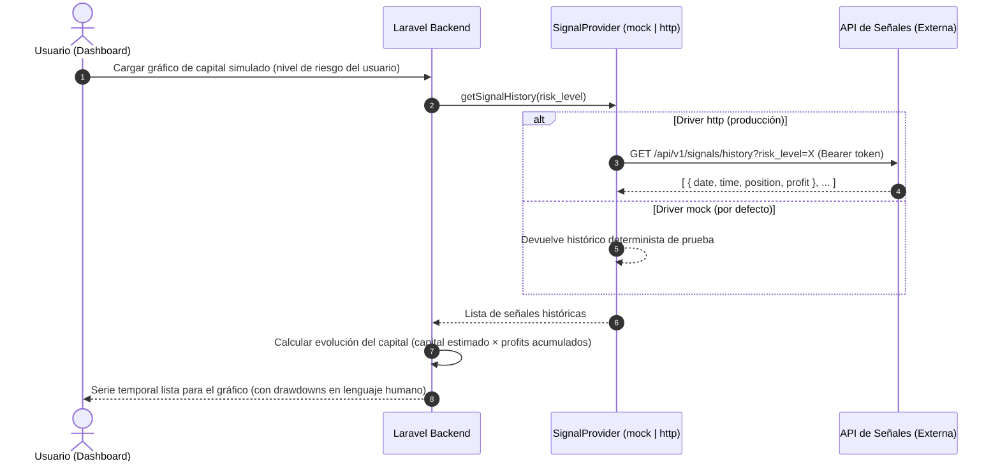

# Documento de Arquitectura de Software: ViBo Invest

Este documento detalla la arquitectura de software, el diseño de red, la estructura de contenedores y los flujos clave de datos para **ViBo Invest**, una plataforma web simple de automatización de trading para inversores minoristas.

---

## 1. Diagrama General del Sistema

El siguiente diagrama ilustra cómo interactúan los componentes de ViBo Invest, el proveedor externo de señales y el exchange Binance. Muestra el flujo de **sondeo (polling) en tiempo casi real** de la API de señales parametrizado por nivel de riesgo y la ejecución directa en Binance, operando como un **Gatekeeper** de seguridad.

> [!NOTE]
> El acceso a la API de señales se encapsula tras el contrato `SignalProvider` con dos drivers intercambiables por configuración: `mock` (interno, **por defecto**, usado en desarrollo y tests) y `http` (API externa real). El resto del sistema es agnóstico al driver activo.

---

## 2. Topología de Contenedores Docker (Entorno de Producción)

Para garantizar aislamiento, escalabilidad y facilidad de mantenimiento en producción, el proyecto está estructurado en microservicios dockerizados mediante Docker Compose.

### Detalle de los Servicios de Contenedores

1.  **`web` (Nginx)**: Actúa como proxy inverso y servidor web para archivos estáticos. Redirige peticiones PHP al contenedor `app` y expone los puertos públicos HTTP (80) y HTTPS (443).
2.  **`app` (PHP-FPM 8.4)**: Aloja el código de Laravel 12. Ejecuta la lógica del backend, el cifrado/descifrado de credenciales y la API interna.
3.  **`websocket` (Laravel Reverb)**: Servidor nativo de WebSockets para Laravel 12 que maneja conexiones bidireccionales en vivo con el cliente para actualizar saldos y estados sin saturar el servidor HTTP.
4.  **`redis` (Redis Cache & Queue)**: Broker de mensajería rápido en memoria. Gestiona las colas de ejecución de órdenes (que deben procesarse de inmediato de forma asíncrona) y actúa como backend Pub/Sub para Reverb.
5.  **`db` (MySQL 8.0)**: Almacena los datos de usuarios, configuraciones de riesgo, bots y el historial de actividad traducido. El contenido inicial dinámico se inicializa usando `Laravel Seeders`.
6.  **`queue-worker`**: Proceso PHP dedicado en segundo plano que corre indefinidamente (`php artisan queue:work`) para consumir trabajos pendientes en Redis (como las peticiones de compra/venta a Binance).
7.  **`scheduler-worker`**: Proceso PHP encargado de disparar el planificador de Laravel (`php artisan schedule:work`), gestionando las auditorías de seguridad periódicas de las llaves API de Binance y el **sondeo de señales en tiempo casi real** (Laravel 12 soporta frecuencias sub-minuto, ej. `everyFiveSeconds()`), que consulta la API de señales con cada nivel de riesgo activo.

---

## 3. Flujos Críticos de Datos y Seguridad

### 3.1. Sondeo de Señales Externas en Tiempo Real (Polling parametrizado por Nivel de Riesgo)

El sistema consulta la API externa de señales en un ciclo de sondeo de tiempo casi real (intervalo configurable, por defecto ~5 segundos), pasando como parámetro el **nivel de riesgo**. La API responde con la **posición objetivo actual** (`LONG`, `SHORT` o `CLOSE`); solo se actúa si difiere de la última posición conocida.

**Decisión: polling en lugar de webhook entrante.** Justificación:
*   La respuesta depende del parámetro `risk_level`, lo que encaja con un modelo request/response y no con un push genérico.
*   El contrato basado en **estado objetivo** es resiliente: un ciclo de sondeo nunca "pierde" una señal (si un ciclo falla, el siguiente recupera el estado), mientras que un webhook perdido desincroniza el sistema.
*   No se expone ningún endpoint público entrante, eliminando la superficie de ataque (suplantación de señales, replay) que obligaba a firmar con HMAC.
*   Hace trivial el reemplazo por el **driver mock** en desarrollo y tests.

La autenticación saliente hacia la API externa se realiza mediante token (cabecera `Authorization: Bearer`). El sondeo se ejecuta **una vez por nivel de riesgo activo** (máximo 3 consultas por ciclo), no por usuario, y el resultado se propaga a todos los usuarios suscritos a ese nivel.

> El contrato exacto de la API externa real está pendiente de confirmación con el proveedor; el contrato descrito (señal actual + histórico) es el implementado por el driver mock.

Si la API externa no responde tras los reintentos configurados, el sistema **mantiene la última posición conocida** sin generar órdenes, registra la incidencia y muestra un aviso amigable en el dashboard.

### 3.2. Vinculación Segura de API Keys de Binance (Aislamiento Total)

Durante el onboarding del usuario, se valida que la clave API provista no ponga en riesgo sus fondos, asegurando que **no tenga permisos de retiro**.

### 3.3. Auditoría Periódica de Seguridad (Cron / Job)

Un script en segundo plano verifica diariamente que las API Keys sigan siendo seguras, bloqueando el bot inmediatamente ante cambios externos.

### 3.4. Generación del Gráfico de Progreso del Capital Simulado (Modelo Híbrido)

La API externa de señales (o su mock) suministra el **histórico de señales** con fecha, hora, posición y profit para un nivel de riesgo. ViBo Invest calcula **localmente** la evolución del capital simulado aplicando el capital estimado del usuario sobre esa lista, y genera el gráfico de progreso del dashboard.

El resultado se cachea en Redis (TTL corto) para evitar recalcular la curva en cada visita al dashboard.

---

## 4. Stack de Tecnologías y Decisiones de Arquitectura

| Componente | Tecnología Seleccionada | Justificación y Detalles Técnicos |
| :--- | :--- | :--- |
| **Framework Base** | **Laravel 12** *(PHP 8.4)* | La versión actual con soporte y parches de seguridad (Laravel 11 alcanzó su EOL de seguridad en marzo de 2026 y composer bloquea su instalación por avisos sin parche; decisión 2026-06-11). Ofrece una estructura de archivos minimalista, soporte nativo de colas mejorado, y la integración directa con Laravel Reverb sin costes externos. |
| **Vistas e Interfaz** | **Blade Templates + Vite** | Las plantillas compiladas en el servidor proporcionan una carga inicial rapidísima. Vite compila los assets CSS/JS instantáneamente permitiendo una experiencia reactiva fluida. |
| **Framework CSS** | **Tailwind CSS 4** | La última versión de Tailwind CSS, que se compila de manera mucho más rápida y nativa a través de CSS puro, combinada con **Vanilla CSS** para animaciones y micro-interacciones premium HSL. |
| **Motor de Base de Datos** | **MySQL 8.0** | Motor de base de datos relacional estándar del sector, ideal para mantener la integridad referencial de usuarios, configuraciones de protección y registros históricos. |
| **Gestión Dinámica** | **Laravel Seeders** | Utilizado para inyectar datos de configuración del sistema, niveles de riesgo estándar, y para cargar el set de datos históricos con el cual se ejecutan las simulaciones locales (Shadow Mode). |
| **Mensajería y Colas** | **Redis 7 (Alpine)** | Proporciona la latencia ultrabaja requerida para gestionar las colas de trabajos y sirve como puente Pub/Sub para propagar eventos a los sockets de forma eficiente. |
| **Servidor WebSockets** | **Laravel Reverb** | Servidor WebSocket de alto rendimiento integrado de forma nativa en Laravel 12. Elimina la necesidad de usar servicios de pago de terceros (como Pusher) para notificar saldos y cambios de estado en tiempo real. |
| **Integración de Señales** | **Polling saliente + Bearer Token** | El scheduler consulta la API externa de señales en tiempo casi real (sub-minuto, ~5s) pasando el nivel de riesgo. Contrato basado en estado objetivo (`LONG`/`SHORT`/`CLOSE`): resiliente a fallos, sin endpoints públicos entrantes que proteger. Autenticación saliente con token Bearer sobre HTTPS. |
| **Abstracción del Proveedor** | **Contract/Driver de Laravel (`SignalProvider`)** | Interfaz única con dos drivers seleccionables vía `SIGNALS_PROVIDER=mock\|http`. El driver `mock` (por defecto) replica el contrato completo de la API real y es la base de los tests automatizados y del entorno de desarrollo; el driver `http` consume la API externa real. |
| **Cifrado de Credenciales** | **AES-256-GCM** | Cifrado simétrico estándar de nivel militar para almacenar de manera segura las claves de Binance API de los usuarios en reposo en la base de datos MySQL. |

---

## 5. Diseño del Despliegue en Docker (Estructura Multietapa Conceptual)

Para llevar esta arquitectura a producción, el contenedor principal de la aplicación (`app`) utiliza una construcción multietapa (*multi-stage build*) en su Dockerfile para evitar meter dependencias de desarrollo (como Node o Composer completo) en la imagen final de producción.

### Estructura de Archivos Docker Recomendada
*   `docker-compose.prod.yml`: Define los servicios listos para producción con políticas de reinicio automático (`restart: unless-stopped`), redes aisladas y montajes de volumen seguros.
*   `Dockerfile`:
    *   **Etapa 1 (Assets Compile)**: Descarga Node.js, instala dependencias de frontend y compila el CSS de Tailwind 4 y Vanilla JS usando Vite (`npm run build`).
    *   **Etapa 2 (PHP Backend Prep)**: Descarga PHP-FPM, instala composer, descarga las dependencias de Laravel optimizadas para producción (`composer install --no-dev --optimize-autoloader`).
    *   **Etapa 3 (Final Production Image)**: Copia el código limpio, los archivos de configuración y los assets ya compilados de la etapa 1 y 2 en una imagen PHP limpia y segura, configurando permisos mínimos de lectura/escritura en el almacenamiento de Laravel.
