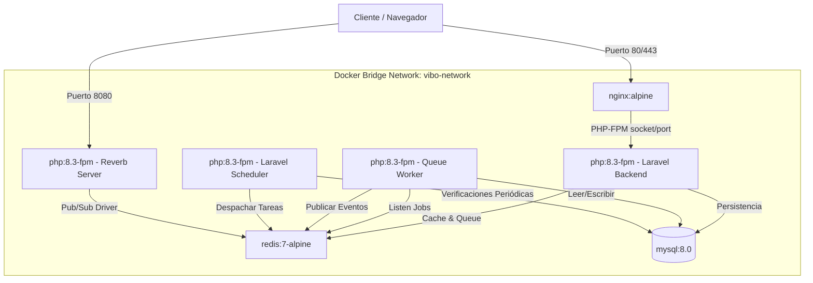
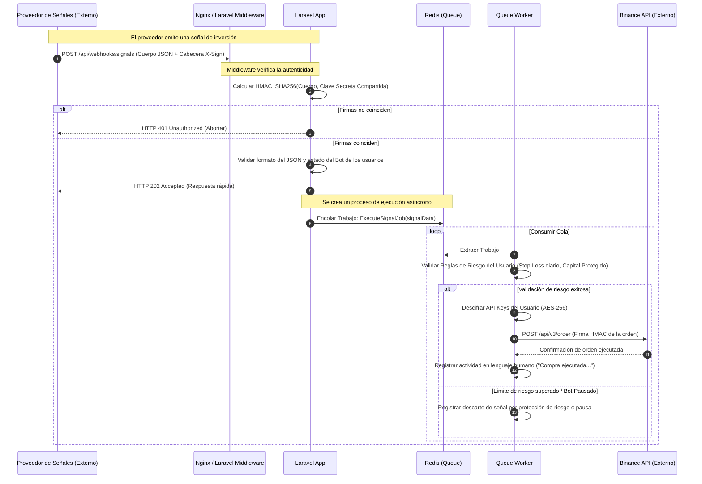
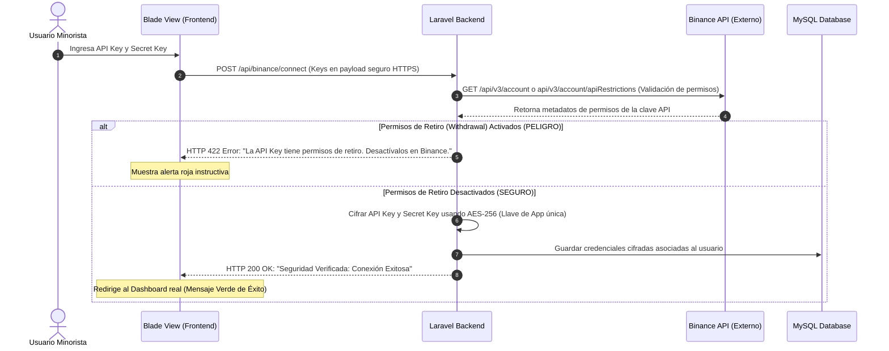
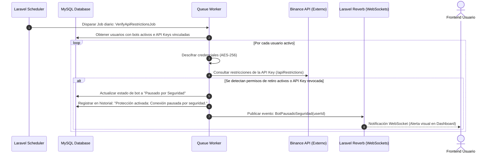

# Documento de Arquitectura de Software: ViBo Invest

Este documento detalla la arquitectura de software, el diseño de red, la estructura de contenedores y los flujos clave de datos para **ViBo Invest**, una plataforma web simple de automatización de trading para inversores minoristas.

---

## 1. Diagrama General del Sistema

El siguiente diagrama ilustra cómo interactúan los componentes de ViBo Invest, el proveedor externo de señales y el exchange Binance. Muestra el flujo de entrada de señales a través de un webhook seguro y la ejecución directa en Binance, operando como un **Gatekeeper** de seguridad.

```mermaid
graph TB
    subgraph Proveedor Externo
        SignalsAPI[API de Señales]
    end

    subgraph Client Side (Navegador)
        UI[Blade Views + Alpine.js/JS]
        WSClient[WebSocket Client - Echo/Reverb]
    end

    subgraph ViBo Invest Cloud (Docker Network)
        Nginx[Nginx Web Server Container]
        Laravel[Laravel 11 App Container]
        Redis[Redis Container: Colas/Caché/PubSub]
        MySQL[(MySQL Database)]
        Reverb[Laravel Reverb WS Container]
        Worker[Queue Worker Container]
    end

    subgraph Exchange Externo
        Binance[Binance API]
    end

    %% Flujos de señales y ejecución
    SignalsAPI -->|1. Webhook POST + HMAC| Nginx
    Nginx -->|Proxy Pass| Laravel
    Laravel -->|2. Validar HMAC y Firma| Laravel
    Laravel -->|3. Validar Reglas de Riesgo y SL| MySQL
    Laravel -->|4. Despachar Trabajo de Compra/Venta| Redis
    Redis -->|5. Procesar Job| Worker
    Worker -->|6. Leer API Keys Cifradas| MySQL
    Worker -->|7. Ejecutar Orden Firmada| Binance

    %% Flujos de la interfaz de usuario
    UI -->|HTTP Requests| Nginx
    Nginx -->|Route| Laravel
    Laravel -->|Guardar datos / Config| MySQL
    Worker -->|8. Publicar evento completado| Redis
    Redis -->|9. Pub/Sub Evento WS| Reverb
    Reverb -->|10. Notificación en tiempo real| WSClient
    WSClient -->|Actualizar Balance & Bot Status| UI
```

---

## 2. Topología de Contenedores Docker (Entorno de Producción)

Para garantizar aislamiento, escalabilidad y facilidad de mantenimiento en producción, el proyecto está estructurado en microservicios dockerizados mediante Docker Compose.



### Detalle de los Servicios de Contenedores

1.  **`web` (Nginx)**: Actúa como proxy inverso y servidor web para archivos estáticos. Redirige peticiones PHP al contenedor `app` y expone los puertos públicos HTTP (80) y HTTPS (443).
2.  **`app` (PHP-FPM 8.3/8.4)**: Aloja el código de Laravel 11. Ejecuta la lógica del backend, el cifrado/descifrado de credenciales y la API interna.
3.  **`websocket` (Laravel Reverb)**: Servidor nativo de WebSockets para Laravel 11 que maneja conexiones bidireccionales en vivo con el cliente para actualizar saldos y estados sin saturar el servidor HTTP.
4.  **`redis` (Redis Cache & Queue)**: Broker de mensajería rápido en memoria. Gestiona las colas de ejecución de órdenes (que deben procesarse de inmediato de forma asíncrona) y actúa como backend Pub/Sub para Reverb.
5.  **`db` (MySQL 8.0)**: Almacena los datos de usuarios, configuraciones de riesgo, bots y el historial de actividad traducido. El contenido inicial dinámico se inicializa usando `Laravel Seeders`.
6.  **`queue-worker`**: Proceso PHP dedicado en segundo plano que corre indefinidamente (`php artisan queue:work`) para consumir trabajos pendientes en Redis (como las peticiones de compra/venta a Binance).
7.  **`scheduler-worker`**: Proceso PHP encargado de disparar el planificador de Laravel (`php artisan schedule:work`) cada minuto, gestionando las auditorías de seguridad periódicas de las llaves API de Binance.

---

## 3. Flujos Críticos de Datos y Seguridad

### 3.1. Recepción y Validación de Señales Externas (Webhook + HMAC)

Para evitar que actores maliciosos envíen falsas señales de compra/venta y ejecuten operaciones no autorizadas, se valida una firma HMAC en las cabeceras de cada petición entrante del proveedor de señales.



### 3.2. Vinculación Segura de API Keys de Binance (Aislamiento Total)

Durante el onboarding del usuario, se valida que la clave API provista no ponga en riesgo sus fondos, asegurando que **no tenga permisos de retiro**.



### 3.3. Auditoría Periódica de Seguridad (Cron / Job)

Un script en segundo plano verifica diariamente que las API Keys sigan siendo seguras, bloqueando el bot inmediatamente ante cambios externos.



---

## 4. Stack de Tecnologías y Decisiones de Arquitectura

| Componente | Tecnología Seleccionada | Justificación y Detalles Técnicos |
| :--- | :--- | :--- |
| **Framework Base** | **Laravel 11** *(PHP 8.3)* | La versión recomendada más reciente. Ofrece una estructura de archivos minimalista, soporte nativo de colas mejorado, y la integración directa con Laravel Reverb sin costes externos. |
| **Vistas e Interfaz** | **Blade Templates + Vite** | Las plantillas compiladas en el servidor proporcionan una carga inicial rapidísima. Vite compila los assets CSS/JS instantáneamente permitiendo una experiencia reactiva fluida. |
| **Framework CSS** | **Tailwind CSS 4** | La última versión de Tailwind CSS, que se compila de manera mucho más rápida y nativa a través de CSS puro, combinada con **Vanilla CSS** para animaciones y micro-interacciones premium HSL. |
| **Motor de Base de Datos** | **MySQL 8.0** | Motor de base de datos relacional estándar del sector, ideal para mantener la integridad referencial de usuarios, configuraciones de protección y registros históricos. |
| **Gestión Dinámica** | **Laravel Seeders** | Utilizado para inyectar datos de configuración del sistema, niveles de riesgo estándar, y para cargar el set de datos históricos con el cual se ejecutan las simulaciones locales (Shadow Mode). |
| **Mensajería y Colas** | **Redis 7 (Alpine)** | Proporciona la latencia ultrabaja requerida para gestionar las colas de trabajos y sirve como puente Pub/Sub para propagar eventos a los sockets de forma eficiente. |
| **Servidor WebSockets** | **Laravel Reverb** | Servidor WebSocket de alto rendimiento integrado de forma nativa en Laravel 11. Elimina la necesidad de usar servicios de pago de terceros (como Pusher) para notificar saldos y cambios de estado en tiempo real. |
| **Seguridad de Webhook** | **HMAC-SHA256** | El proveedor externo de señales firma las solicitudes con un hash calculado a partir del cuerpo del JSON y una clave secreta compartida. Evita ataques de suplantación y ataques de repetición (Replay attacks). |
| **Cifrado de Credenciales** | **AES-256-GCM** | Cifrado simétrico estándar de nivel militar para almacenar de manera segura las claves de Binance API de los usuarios en reposo en la base de datos MySQL. |

---

## 5. Diseño del Despliegue en Docker (Estructura Multietapa Conceptual)

Para llevar esta arquitectura a producción, el contenedor principal de la aplicación (`app`) utiliza una construcción multietapa (*multi-stage build*) en su Dockerfile para evitar meter dependencias de desarrollo (como Node o Composer completo) en la imagen final de producción.

### Estructura de Archivos Docker Recomendada
*   `docker-compose.prod.yml`: Define los servicios listos para producción con políticas de reinicio automático (`restart: unless-stopped`), redes aisladas y montajes de volumen seguros.
*   `Dockerfile`:
    *   **Etapa 1 (Assets Compile)**: Descarga Node.js, instala dependencias de frontend y compila el CSS de Tailwind 4 y Vanilla JS usando Vite (`npm run build`).
    *   **Etapa 2 (PHP Backend Prep)**: Descarga PHP-FPM, instala composer, descarga las dependencias de Laravel optimizadas para producción (`composer install --no-dev --optimize-autoloader`).
    *   **Etapa 3 (Final Production Image)**: Copia el código limpio, los archivos de configuración y los assets ya compilados de la etapa 1 y 2 en una imagen PHP limpia y segura, configurando permisos mínimos de lectura/escritura en el almacenamiento de Laravel.
