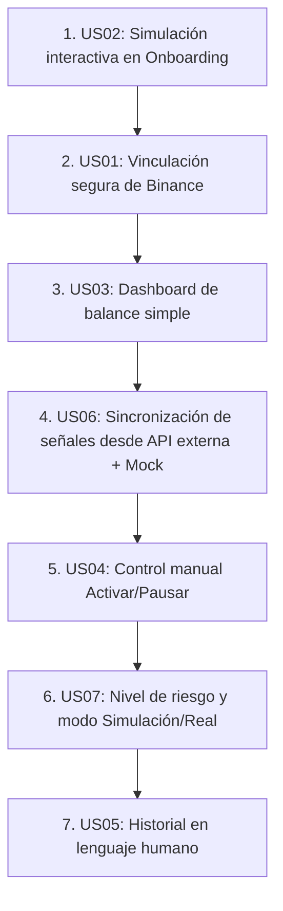

# User Stories: ViBo Invest MVP

Este documento define las 7 User Stories principales para el MVP de **ViBo Invest**, estructuradas bajo el criterio **INVEST** y utilizando el formato de desarrollo guiado por comportamiento (**BDD**) para sus criterios de aceptación.

> [!NOTE]
> **Origen de las Señales y Aislamiento de Credenciales**: El bot de trading obtiene las señales consultando (polling) una API externa al proyecto, pasándole como parámetro el nivel de riesgo configurado por el usuario. La API responde con la posición objetivo actual (`LONG`, `SHORT` o `CLOSE`). Las API Keys de Binance del usuario permanecen aisladas en el backend de ViBo Invest y **nunca** se envían al proveedor de señales. ViBo Invest actúa como *gatekeeper* de **seguridad**: compara la señal recibida con la última posición conocida, comprueba que el bot siga activo y que la cuenta supere las verificaciones de seguridad (sin permisos de retiro, credenciales válidas) y ejecuta los ajustes de posición de manera directa y segura en Binance. No aplica reglas de riesgo de trading propias: replica la señal del proveedor externo. Por defecto, el sistema utiliza un **proveedor de señales mock interno** (mismo contrato que la API real) para desarrollo y tests.

---

## 1. User Stories del MVP

### US01: Vinculación Segura de Cuenta de Binance con Validación de Permisos de Retiro y Aislamiento de Llaves
* **Título descriptivo:** Vinculación segura de cuenta de Binance sin permisos de retiro y con aislamiento de llaves.
* **Fórmula de Historia:**
  * **Como** usuario listo para operar en real,
  * **quiero** que la plataforma valide que mi API Key de Binance no tenga activados los permisos de retiro y que mis llaves se mantengan estrictamente aisladas dentro del backend de la plataforma,
  * **para** tener la absoluta seguridad de que mi dinero nunca podrá ser retirado ni mis credenciales expuestas a proveedores externos de señales.
* **Criterios de Aceptación (BDD):**
  * **Escenario 1: Detección de permisos de retiro activos durante la vinculación**
    * **Dado que** estoy en la pantalla de vinculación de Binance y he ingresado mi API Key y Secret Key,
    * **cuando** el sistema comprueba los permisos con la API de Binance y detecta que la opción de retiros (*withdrawals*) está habilitada,
    * **entonces** el sistema debe mostrar un mensaje de alerta destacado en rojo que explique de forma sencilla cómo desactivar dicha opción y debe bloquear la vinculación de la API.
  * **Escenario 2: Vinculación exitosa con permisos de retiro desactivados**
    * **Dado que** estoy en la pantalla de vinculación de Binance y he ingresado mi API Key y Secret Key,
    * **cuando** el sistema comprueba los permisos con la API de Binance y detecta que la opción de retiros está deshabilitada,
    * **entonces** el sistema debe permitir la vinculación, redirigirme al Dashboard real y mostrar un mensaje verde destacado de confirmación de seguridad ("Seguridad Verificada: ViBo Invest no puede retirar tus fondos").
  * **Escenario 3: Verificación periódica en segundo plano**
    * **Dado que** tengo mi API Key de Binance vinculada y el bot está activo,
    * **cuando** el sistema realiza la verificación periódica automatizada de permisos y detecta que se han habilitado los permisos de retiro en Binance,
    * **entonces** el sistema debe pausar de forma inmediata la actividad del bot por seguridad y notificar al usuario de forma destacada en la interfaz web.
* **Estimación de complejidad:** M (Medium)
* **Evaluación contra INVEST:**
  * **I (Independiente):** Es independiente de la lógica de trading o de la visualización de balances históricos; se centra solo en la pasarela de autenticación y verificación de permisos.
  * **N (Negociable):** La frecuencia de la validación periódica (ej. cada 24 horas o cada hora) y el diseño visual de la guía técnica son ajustables.
  * **V (Valioso):** Crucial para mitigar el miedo del usuario minorista y generar confianza al garantizar que el capital permanece seguro en su exchange.
  * **E (Estimable):** La documentación de la API de Binance define claramente los endpoints para consultar los permisos de una API Key vinculada.
  * **S (Pequeño):** Se acota estrictamente al flujo de ingreso, validación técnica y persistencia segura de credenciales API.
  * **T (Testeable):** Se puede testear mediante mocks de la API de Binance simulando respuestas con y sin permisos de retiro.

---

### US02: Configuración de Perfil de Riesgo y Simulación Histórica Interactiva en Onboarding
* **Título descriptivo:** Simulación personalizada basada en perfil de riesgo y capital estimado.
* **Fórmula de Historia:**
  * **Como** usuario recién registrado,
  * **quiero** realizar un cuestionario rápido de perfil de riesgo y ajustar mi capital con un deslizador,
  * **para** visualizar una simulación interactiva y honesta del rendimiento histórico de mi inversión sin poner en riesgo dinero real.
* **Criterios de Aceptación (BDD):**
  * **Escenario 1: Generación de proyección dinámica según parámetros del usuario**
    * **Dado que** he completado mi registro e iniciado el onboarding,
    * **cuando** selecciono un perfil de riesgo (Conservador, Balanceado, Agresivo) y ajusto el slider de capital estimado a un valor específico (ej. 1000$),
    * **entonces** el sistema debe proyectar dinámicamente un gráfico histórico con la evolución de la inversión basado en esos parámetros.
  * **Escenario 2: Transparencia en la visualización de caídas temporales (Drawdowns)**
    * **Dado que** estoy interactuando con el gráfico de simulación en el onboarding,
    * **cuando** el gráfico dibuja la evolución temporal del bot,
    * **entonces** debe destacar explícitamente tanto el rendimiento positivo acumulado como la peor caída temporal sufrida históricamente en lenguaje natural (ej. "La cuenta ha tenido caídas temporales de hasta un 12%").
  * **Escenario 3: Persistencia de parámetros iniciales**
    * **Dado que** he terminado de revisar la simulación del onboarding,
    * **cuando** hago clic en el botón de confirmación para finalizar el onboarding,
    * **entonces** el sistema debe guardar mi perfil de riesgo y capital estimado para establecerlos como la configuración por defecto de mi bot en modo simulación.
* **Estimación de complejidad:** M (Medium)
* **Evaluación contra INVEST:**
  * **I (Independiente):** Funciona completamente del lado del cliente y del servidor con datos históricos y modelos matemáticos internos; no requiere conexión con Binance en vivo para funcionar.
  * **N (Negociable):** Los textos descriptivos de cada nivel de riesgo y los límites mínimos/máximos del deslizador son flexibles y abiertos a cambios de diseño de producto.
  * **V (Valioso):** Es el primer punto de contacto real con el valor del producto, demostrando transparencia (al mostrar pérdidas históricas) y disminuyendo la fricción inicial.
  * **E (Estimable):** El equipo puede estimar con exactitud el esfuerzo de construir la interfaz interactiva y el set de datos simulados fijos para las proyecciones.
  * **S (Pequeño):** Se limita al flujo guiado inicial y su salida visual interactiva, sin interferir con la integración de trading real.
  * **T (Testeable):** Se puede comprobar validando que al cambiar de perfil de riesgo o mover el slider de capital, el gráfico y los textos de pérdidas asociadas se recalculan dinámicamente.

---

### US03: Visualización de Balance Total y Gráfico de Rendimiento Lineal Simple en Dashboard
* **Título descriptivo:** Dashboard principal con visualización de balance y gráfico de evolución simple.
* **Fórmula de Historia:**
  * **Como** usuario activo,
  * **quiero** ver el balance total de mi cuenta de Binance de forma clara y un gráfico lineal simple de su evolución,
  * **para** conocer de un vistazo el rendimiento general de mi dinero sin distraerme con gráficos técnicos de trading.
* **Criterios de Aceptación (BDD):**
  * **Escenario 1: Carga del dashboard limpio de complejidad técnica**
    * **Dado que** he accedido al Dashboard de mi cuenta vinculada,
    * **cuando** carga la página principal,
    * **entonces** el sistema debe mostrar mi balance consolidado en euros/dólares en letra grande y legible, y un gráfico de líneas sin indicadores técnicos (sin velas, RSI, MACD o libros de órdenes).
  * **Escenario 2: Cambio interactivo del filtro temporal**
    * **Dado que** estoy visualizando el gráfico de evolución en el dashboard,
    * **cuando** selecciono uno de los filtros temporales (Día, Semana, Mes),
    * **entonces** el gráfico lineal debe actualizarse dinámicamente mostrando la serie temporal correspondiente y el porcentaje de cambio del balance en lenguaje humano.
  * **Escenario 3: Actualización reactiva del balance**
    * **Dado que** el saldo en mi cuenta real de Binance cambia debido a operaciones,
    * **cuando** el backend sincroniza los datos del exchange,
    * **entonces** el balance en pantalla debe actualizarse de forma reactiva con una transición visual sutil para denotar el estado vivo de la cuenta.
* **Estimación de complejidad:** M (Medium)
* **Evaluación contra INVEST:**
  * **I (Independiente):** Es independiente de las pantallas de onboarding y de las acciones de encendido/apagado manual del bot; solo consulta y visualiza balances.
  * **N (Negociable):** La paleta de colores del gráfico, el tipo de gráfico lineal y el intervalo exacto de actualización de datos se pueden ajustar tras pruebas de UX.
  * **V (Valioso):** Responde a la necesidad básica del usuario de monitorear y entender el estado de sus ahorros de forma rápida y sin estrés cognitivo.
  * **E (Estimable):** Las librerías de gráficos web estándar y las APIs de consulta de Binance simplifican y hacen predecible la estimación de esta tarea.
  * **S (Pequeño):** Se centra de forma exclusiva en la visualización agregada y el comportamiento de filtros de tiempo, abstrayéndose de la lógica interna de compra/venta.
  * **T (Testeable):** Se puede verificar mediante pruebas unitarias y de integración inyectando conjuntos de datos de balances con diferentes rangos y validando su renderizado correcto.

---

### US04: Control de Encendido/Apagado Manual e Instantáneo del Bot
* **Título descriptivo:** Control manual de activación y pausa del bot.
* **Fórmula de Historia:**
  * **Como** usuario en control de su riesgo,
  * **quiero** poder activar y pausar el bot de trading mediante un único botón simple en el dashboard,
  * **para** detener o reanudar las operaciones de inmediato si el mercado o mi situación personal me generan intranquilidad.
* **Criterios de Aceptación (BDD):**
  * **Escenario 1: Activación instantánea del bot**
    * **Dado que** el bot de trading se encuentra en estado "Pausado",
    * **cuando** hago clic en el botón "Activar",
    * **entonces** el sistema debe cambiar el estado del bot a "Activo" en la base de datos, enviar una señal al motor de ejecución de órdenes y actualizar el indicador visual en pantalla a verde en tiempo real.
  * **Escenario 2: Pausado instantáneo del bot**
    * **Dado que** el bot de trading se encuentra en estado "Activo",
    * **cuando** hago clic en el botón "Pausar",
    * **entonces** el sistema debe cambiar el estado del bot a "Pausado" en la base de datos, detener de forma inmediata la colocación de nuevas órdenes en Binance y cambiar el indicador visual a un color gris/ámbar.
  * **Escenario 3: Cierre preventivo al pausar**
    * **Dado que** el bot se encuentra en estado "Activo" y tiene posiciones de trading abiertas,
    * **cuando** el usuario hace clic en "Pausar",
    * **entonces** el sistema debe proceder a gestionar o cerrar preventivamente las posiciones activas en Binance de forma segura según la regla de mitigación definida, antes de establecer el estado "Pausado" definitivo.
* **Estimación de complejidad:** S (Small)
* **Evaluación contra INVEST:**
  * **I (Independiente):** Si bien activa o desactiva la ejecución del motor de trading, el flujo de cambio de estado y control del botón en el UI es modular.
  * **N (Negociable):** La lógica de mitigación en Binance al presionar "Pausar" (ej. cancelar órdenes límite abiertas, cerrar a mercado o mantener posiciones actuales) es negociable según el comportamiento de seguridad ideal.
  * **V (Valioso):** Otorga al usuario el control absoluto de su capital en tiempo real, lo que genera un gran alivio psicológico ante fluctuaciones del mercado.
  * **E (Estimable):** El equipo puede estimar fácilmente la creación del endpoint del backend para cambiar el estado y la reactividad del botón en la interfaz.
  * **S (Pequeño):** Consiste en un interruptor digital lógico (On/Off) y su respectiva propagación a los hilos de ejecución del backend.
  * **T (Testeable):** Se puede verificar mediante pruebas automáticas que comprueban que el backend rechaza o detiene nuevas órdenes si el flag de estado se encuentra en "Pausado".

---

### US05: Historial de Transacciones y Acciones del Bot Redactado en Lenguaje Humano
* **Título descriptivo:** Historial de actividad del bot redactado en lenguaje sencillo.
* **Fórmula de Historia:**
  * **Como** usuario no técnico,
  * **quiero** ver un registro de actividad reciente con explicaciones claras y naturales sobre las acciones tomadas por el bot,
  * **para** entender por qué se realizaron transacciones sin necesidad de analizar códigos o logs complejos.
* **Criterios de Aceptación (BDD):**
  * **Escenario 1: Conversión de transacciones a lenguaje humano**
    * **Dado que** el bot ha operado recientemente en mi cuenta,
    * **cuando** navego a la pestaña de "Actividad",
    * **entonces** el sistema debe mostrar un feed de eventos donde cada orden de Binance esté traducida a lenguaje natural (ej. "Se realizó una compra para aprovechar una caída temporal de precio" en lugar de un código de transacción crudo).
  * **Escenario 2: Visualización amigable de rendimientos individuales**
    * **Dado que** una posición se ha cerrado con beneficio o pérdida,
    * **cuando** se lista en el historial de actividad,
    * **entonces** debe mostrarse de forma explícita el resultado neto (ej. "Posición cerrada con un +1.5% de beneficio (+15$)" o "Protección de pérdida activada para asegurar tu capital").
  * **Escenario 3: Resaltado visual de eventos de protección de seguridad**
    * **Dado que** el bot activa una protección automática de **seguridad** (p. ej. se detectan permisos de retiro indebidos o credenciales inválidas en la cuenta de Binance),
    * **cuando** este evento se registra en el feed de actividad,
    * **entonces** el sistema debe destacarlo visualmente con un diseño de alerta en la parte superior del historial (ej. "Protección diaria activada: El bot se pausó automáticamente para proteger tu capital"). *(Actualizado 2026-06-21: estas alertas ya solo se generan por seguridad; se retiró el gatekeeper de riesgo de trading —stop-loss diario / capital protegido—.)*
* **Estimación de complejidad:** S (Small)
* **Evaluación contra INVEST:**
  * **I (Independiente):** Es independiente de la ejecución en vivo del trading o del onboarding; actúa de manera retrospectiva leyendo registros de base de datos.
  * **N (Negociable):** El catálogo exacto de mensajes de traducción y los criterios de colores para el feed son refinables mediante pruebas con usuarios.
  * **V (Valioso):** Convierte la incertidumbre de las transacciones crudas en transparencia y comprensión total del bot, aumentando la confianza.
  * **E (Estimable):** Crear plantillas de traducción mapeadas a los tipos de transacción y estados del bot es una tarea de desarrollo predecible.
  * **S (Pequeño):** Consiste en un componente de visualización que lee y da formato legible a un registro de eventos ya existente.
  * **T (Testeable):** Se puede comprobar insertando eventos simulados en base de datos y verificando que el frontend despliega las descripciones textuales correctas según el mapa de traducción.

---

### US06: Sincronización de Señales en Tiempo Real desde la API Externa según Nivel de Riesgo (con Proveedor Mock)
* **Título descriptivo:** Gestión de la información de trading desde la API externa de señales: sondeo en tiempo real con nivel de riesgo, ajuste de posiciones y datos del capital simulado.
* **Fórmula de Historia:**
  * **Como** usuario con el bot activo,
  * **quiero** que la plataforma consulte en tiempo real la API externa de señales con mi nivel de riesgo configurado y ajuste automáticamente mi posición en Binance solo cuando la señal cambie,
  * **para** que mis operaciones sigan la estrategia del proveedor sin intervención manual.
* **Criterios de Aceptación (BDD):**
  * **Escenario 1: Detección de cambio de señal y ajuste de posición en Binance**
    * **Dado que** mi bot está "Activo" en modo real con nivel de riesgo "Balanceado" y la última posición conocida es `LONG`,
    * **cuando** el ciclo de sondeo (polling) consulta la API externa con `risk_level=balanceado` y esta responde `CLOSE`,
    * **entonces** el sistema debe comprobar que el bot siga activo, encolar el trabajo de ajuste, cerrar la posición en Binance, registrar el evento en lenguaje humano en el historial y notificar el cambio al dashboard vía WebSocket. *(Actualizado 2026-06-21: ya no se validan reglas de riesgo de trading locales —Stop Loss diario/Capital Protegido—; el bot solo replica la señal externa.)*
  * **Escenario 2: Señal sin cambios (idempotencia del sondeo)**
    * **Dado que** la última posición conocida para mi nivel de riesgo es `LONG`,
    * **cuando** el ciclo de sondeo recibe nuevamente `LONG` de la API externa,
    * **entonces** el sistema no debe generar órdenes, eventos ni registros duplicados.
  * **Escenario 3: Obtención del histórico de señales para el gráfico de capital simulado**
    * **Dado que** estoy visualizando el gráfico de progreso del capital simulado en el dashboard,
    * **cuando** el backend consulta a la API externa el histórico de señales (fecha, hora, posición y profit) para mi nivel de riesgo,
    * **entonces** el sistema debe calcular localmente la evolución del capital simulado a partir de esa lista y renderizar el gráfico de progreso correspondiente.
  * **Escenario 4: Proveedor mock como valor por defecto**
    * **Dado que** el entorno de desarrollo o de tests no tiene configurada la URL de la API externa real,
    * **cuando** el sistema arranca y se ejecuta el ciclo de sondeo o la consulta de histórico,
    * **entonces** debe responder el proveedor mock interno con el mismo contrato que la API real (`LONG`/`SHORT`/`CLOSE` e histórico de señales), permitiendo probar el sistema completo y ejecutar los tests automatizados sin dependencia externa.
  * **Escenario 5: Indisponibilidad de la API externa**
    * **Dado que** el bot está "Activo" y la API externa de señales no responde o devuelve un error,
    * **cuando** el ciclo de sondeo falla los reintentos configurados,
    * **entonces** el sistema debe mantener la última posición conocida sin generar órdenes nuevas, registrar la incidencia y mostrar un aviso amigable en el dashboard (ej. "Conexión temporalmente inestable con el proveedor de señales, tus fondos están seguros").
* **Estimación de complejidad:** M (Medium)
* **Evaluación contra INVEST:**
  * **I (Independiente):** El cliente de señales se encapsula tras un contrato propio (`SignalProvider`), de manera independiente de la UI y de la vinculación de Binance; solo el ejecutor de órdenes consume su salida.
  * **N (Negociable):** El intervalo de sondeo (por defecto 5 segundos), la política de reintentos y el contrato exacto de la API real son ajustables y están pendientes de confirmación con el proveedor.
  * **V (Valioso):** Es el corazón operativo del producto: sin la sincronización de señales el bot no opera; el modelo de polling con estado objetivo garantiza que nunca se "pierda" una señal.
  * **E (Estimable):** El contrato es pequeño y conocido (señal actual + histórico), y el patrón driver/contract de Laravel hace predecible el esfuerzo de las dos implementaciones (mock y HTTP).
  * **S (Pequeño):** Se acota al ciclo de sondeo, la comparación de estado, el despacho del trabajo de ajuste y la consulta de histórico; la ejecución en Binance reutiliza el motor ya definido.
  * **T (Testeable):** El proveedor mock es parte de la historia: todos los escenarios se prueban inyectando secuencias de señales controladas (cambio, repetición, error) sin tocar la API real.

---

### US07: Control de Nivel de Riesgo y Modo Simulación/Real desde el Dashboard
* **Título descriptivo:** Cambio de nivel de riesgo y alternancia entre modo simulación y modo real con controles simples.
* **Fórmula de Historia:**
  * **Como** usuario en control de su inversión,
  * **quiero** poder cambiar mi nivel de riesgo (Conservador, Balanceado, Agresivo) y alternar entre modo simulación y modo real desde el dashboard con controles simples,
  * **para** ajustar la estrategia del bot a mi situación personal sin configuraciones técnicas.
* **Criterios de Aceptación (BDD):**
  * **Escenario 1: Cambio de nivel de riesgo aplicado al sondeo de señales**
    * **Dado que** mi bot opera con nivel de riesgo "Conservador",
    * **cuando** selecciono "Agresivo" en el control de riesgo del dashboard y confirmo el cambio,
    * **entonces** el sistema debe persistir el nuevo nivel, utilizarlo como parámetro en el siguiente ciclo de consulta a la API externa de señales y mostrar una confirmación visual clara del nivel activo.
  * **Escenario 2: Paso de modo real a modo simulación**
    * **Dado que** mi bot está operando en modo real con posiciones abiertas,
    * **cuando** activo el modo simulación,
    * **entonces** el sistema debe gestionar o cerrar preventivamente las posiciones reales en Binance de forma segura (según la regla de mitigación definida en US04) antes de continuar la operativa únicamente en modo simulado.
  * **Escenario 3: Paso de modo simulación a modo real con requisitos de seguridad**
    * **Dado que** mi bot opera en modo simulación,
    * **cuando** intento activar el modo real,
    * **entonces** el sistema debe verificar que tengo una cuenta de Binance vinculada y validada (US01); si no la tengo, debe bloquear el cambio y guiarme al flujo de vinculación con un mensaje claro.
* **Estimación de complejidad:** S (Small)
* **Evaluación contra INVEST:**
  * **I (Independiente):** Gestiona únicamente la configuración del usuario (nivel de riesgo y modo); el sondeo (US06) y el motor de ejecución la consumen sin acoplarse a la UI.
  * **N (Negociable):** El diseño de los controles (selector, toggle) y la regla de gestión de posiciones al cambiar de modo son ajustables tras pruebas de UX.
  * **V (Valioso):** Junto con Activar/Pausar (US04), completa el conjunto mínimo de controles que el usuario tiene sobre el bot: estado, riesgo y modo de operación.
  * **E (Estimable):** Son dos campos de configuración persistidos con sus validaciones y su propagación reactiva al ciclo de sondeo; esfuerzo claramente acotado.
  * **S (Pequeño):** Se limita a los dos controles del dashboard, su persistencia y las validaciones de transición de modo.
  * **T (Testeable):** Se verifica comprobando que el siguiente ciclo de sondeo usa el nuevo `risk_level` (con el proveedor mock) y que las transiciones de modo respetan las validaciones de vinculación y cierre preventivo.

---

## 2. Priorización del MVP y Justificación

Como Product Owner, recomiendo estructurar el desarrollo del MVP de **ViBo Invest** bajo un enfoque de embudo de conversión y seguridad progresiva, priorizando las historias en el siguiente orden:

### Tabla de Priorización

| Orden | ID / Story | Complejidad | Impacto en Confianza / Retención | Justificación |
| :---: | :--- | :---: | :---: | :--- |
| **1** | **US02**: Simulación Interactiva en Onboarding | **M** | **Muy Alto** (Gancho Inicial) | **Conversión y Educación:** Permite al usuario experimentar inmediatamente la propuesta de valor sin fricción, reduciendo el miedo inicial antes de pedirle que vincule sus activos reales o configure exchanges. |
| **2** | **US01**: Vinculación Segura de Binance (No-Retiro) | **M** | **Extremo** (Seguridad) | **Crucial de Seguridad:** Es la puerta de entrada a la operativa real. Si el usuario no confía en este paso o si no se validan los permisos de retiro de forma infalible, el producto entero falla. |
| **3** | **US03**: Dashboard de Balance y Evolución Simple | **M** | **Alto** (Visualización) | **Visibilidad Financiera:** Una vez conectada la API, el usuario necesita ver su balance consolidado actual. Es la pantalla principal de monitoreo diario que fomenta la retención de los usuarios. |
| **4** | **US06**: Sincronización de Señales desde API Externa (+ Mock) | **M** | **Extremo** (Operativa) | **Corazón Operativo:** Sin el sondeo de señales con nivel de riesgo no hay automatización que controlar. El proveedor mock incluido permite construir y probar todo el sistema (y las historias posteriores) sin depender de la API externa real. |
| **5** | **US04**: Control Manual de Activación y Pausa | **S** | **Muy Alto** (Control) | **Paz Mental Activa:** Es el botón de control operativo que permite al usuario decidir cuándo trabaja el bot o apagarlo instantáneamente ante la intranquilidad del mercado. |
| **6** | **US07**: Nivel de Riesgo y Modo Simulación/Real | **S** | **Alto** (Personalización) | **Control de Estrategia:** Completa los controles del usuario sobre el bot (riesgo y modo de operación), aprovechando que el sondeo de señales (US06) ya parametriza el nivel de riesgo. |
| **7** | **US05**: Historial de Actividad en Lenguaje Humano | **S** | **Medio-Alto** (Transparencia) | **Comprensión Operativa:** Proporciona un registro claro de qué está haciendo la automatización. Se sitúa al final del MVP porque requiere que la plataforma ya sea capaz de simular u operar para generar logs de eventos. |

---

### Justificación Detallada del Orden Propuesto

1. **La Simulación como Primer Paso (US02)**: En productos de inversión para usuarios no técnicos, el mayor obstáculo es el miedo a perder dinero. Si exigimos la conexión de Binance (US01) al inicio del flujo, la tasa de abandono se disparará. Mostrando una simulación interactiva, transparente y honesta (que muestre tanto ganancias como caídas históricas reales), ganamos la confianza inicial del usuario en menos de 10 minutos.
2. **Seguridad y Validación Fuerte (US01)**: Una vez convencido con la simulación, el usuario da el paso de vincular su capital real. Aquí, el sistema debe ser implacable en la verificación técnica: impedir la vinculación si hay permisos de retiro es nuestra promesa de seguridad fundamental y no es negociable en el MVP.
3. **El Motor de Señales (US06)**: Con la cuenta visible y conectada, se construye el corazón operativo: el sondeo en tiempo real de la API externa con el nivel de riesgo, el ajuste de posiciones en Binance y la obtención del histórico para el capital simulado. Se desarrolla primero contra el **proveedor mock interno**, lo que desbloquea las historias de control y transparencia sin depender del proveedor real.
4. **Los Controles del Usuario (US03, US04 y US07)**: La visualización simple de su saldo y rendimiento (US03) le permite comprobar que todo está en orden, el botón de Activar/Pausar (US04) le otorga una "válvula de escape" manual, y el control de nivel de riesgo y modo simulación/real (US07) completa el conjunto mínimo y suficiente de acciones disponibles desde la app.
5. **Feed de Actividad Comprensible (US05)**: Por último, el historial en lenguaje humano sirve para responder a la pregunta de *"¿qué está haciendo el bot ahora mismo?"*. Al evitar la jerga técnica y explicar los movimientos como lo haría una persona, cerramos el círculo de simplicidad, transparencia y control sin saturar al usuario en el día a día.
